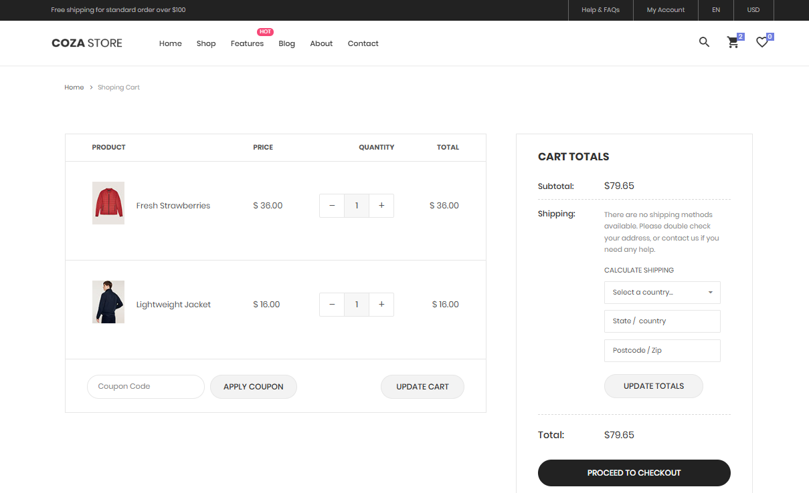
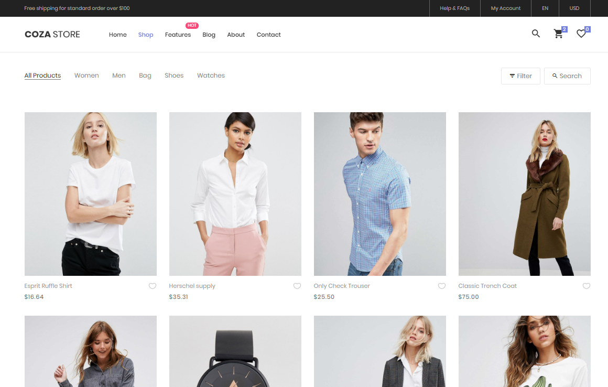

# Административная панель для интернет-магазина

Это проект административной панели для интернет-магазина, разработанный с использованием Django. Панель предназначена для управления заказами, товарами, пользователями, чатами и оплатами.

## Структура проекта

Проект включает следующие компоненты:

- **adminB** - основное приложение проекта, которое включает в себя:
  - **account** - управление учетными записями пользователей.
  - **admin_home** - домашняя страница панели администратора.
  - **cart** - управление корзиной товаров.
  - **chat** - система чатов для общения с клиентами.
  - **customers** - управление данными клиентов.
  - **errors** - обработка ошибок.
  - **locale** - локализация приложения.
  - **media** - хранение медиафайлов.
  - **models** - модели базы данных.
  - **payments** - обработка платежей.
  - **product** - управление товарами.
  - **settings** - настройки проекта.
  - **static** - статические файлы (CSS, JS, изображения).
  - **templates** - HTML-шаблоны.
  - **utils** - утилиты для различных операций.
  - **venv** - виртуальное окружение проекта.

- **scripts** - скрипты для автоматизации задач.
- **web** - фронтенд часть проекта (если есть).
- **manage.py** - основной скрипт для управления проектом Django.
- **.env** - файл конфигурации переменных окружения.

### Изображение сайта

1. 
2. 
3. 

## Установка

### Требования

1. Python 3.8 или выше.
2. Django 3.x или выше.

### Установка базы данных Postgresql

1. Создайте файл .env
2. Укажите DB_NAME, DB_USER... тд

### Установка зависимостей

1. Клонируйте репозиторий:

```bash
git clone https://github.com/Lokrip/django-online-shop.git

pip instal -r requirements.txt

cd adminB

python manage.py makemigrations
python manage.py migrate
python manage.py runserver

